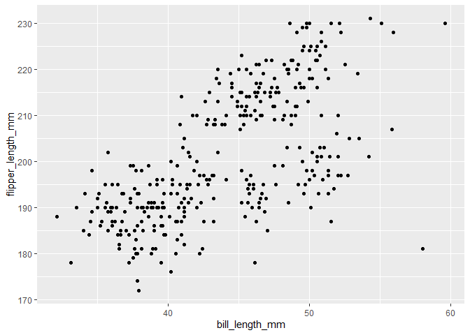

p8105\_hw1\_aw3253
================
Alyssa W.

# Problem 1

``` r
library(tidyverse)
```

    ## -- Attaching packages --------------------------------------- tidyverse 1.3.1 --

    ## v ggplot2 3.3.5     v purrr   0.3.4
    ## v tibble  3.1.4     v dplyr   1.0.7
    ## v tidyr   1.1.3     v stringr 1.4.0
    ## v readr   2.0.1     v forcats 0.5.1

    ## -- Conflicts ------------------------------------------ tidyverse_conflicts() --
    ## x dplyr::filter() masks stats::filter()
    ## x dplyr::lag()    masks stats::lag()

``` r
plot_df = tibble(
  vec_numeric = rnorm(10),
  vec_char = c("D", "A", "T", "A", "S", "C", "I", "E", "N", "C"),
  vec_logical = c(TRUE, TRUE, TRUE, FALSE, TRUE, TRUE, TRUE, FALSE, FALSE, FALSE),
  vec_factor = factor(c("underweight", "overweight", "obese", "obese", "obese", "underweight", "underweight", "obese", "underweight", "underweight"))
)
```

### Finding the mean

``` r
library(tidyverse)
mean(pull(plot_df, var = vec_numeric))
```

    ## [1] 0.192645

``` r
mean(pull(plot_df, var = vec_char))
```

    ## Warning in mean.default(pull(plot_df, var = vec_char)): argument is not numeric
    ## or logical: returning NA

    ## [1] NA

``` r
mean(pull(plot_df, var = vec_logical))
```

    ## [1] 0.6

``` r
mean(pull(plot_df, var = vec_factor))
```

    ## Warning in mean.default(pull(plot_df, var = vec_factor)): argument is not
    ## numeric or logical: returning NA

    ## [1] NA

# Problem 2

``` r
data("penguins", package = "palmerpenguins")
```

This data has The data frame has 344 rows and 8. The mean flipper length
is NA.

### Scatterplot

``` r
new <- ggplot(penguins, aes(x = bill_length_mm, y=flipper_length_mm)) + geom_point()

new
```

    ## Warning: Removed 2 rows containing missing values (geom_point).

<!-- -->
